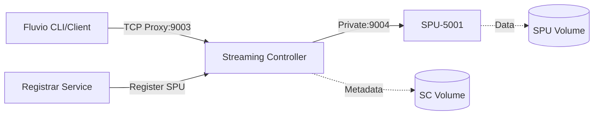

# Deploy Fluvio on Railway

[Fluvio](https://www.fluvio.io/) is a high-performance, distributed streaming platform built in Rust. It provides a lightweight alternative to Apache Kafka with built-in WebAssembly support for stream processing. Perfect for building real-time data pipelines, event streaming applications, and IoT data collection with minimal resource overhead.

[](https://railway.com/template/fluvio)

## About Hosting Fluvio

Hosting a Fluvio cluster requires coordination between multiple components: a Streaming Controller (SC) for metadata management, Streaming Processing Units (SPUs) for data storage and replication, and proper network configuration for inter-service communication. This template provides a pre-configured setup with IPv6 networking support, automatic SPU registration, and persistent storage volumes. Railway handles the infrastructure automatically - no Kubernetes knowledge, manual scaling, or complex networking setup needed.

## Architecture Overview



## Common Use Cases

- Real-time event streaming and processing
- IoT data collection and aggregation
- Log aggregation and analysis pipelines
- Message queue replacement for microservices
- Building event-driven architectures
- Stream processing with WebAssembly

## Dependencies for Fluvio Hosting

- Fluvio stable Docker images
- IPv6 networking support (Railway provides this)
- Persistent volumes for data storage
- TCP proxy for external connectivity
- Service discovery via private networking

### Deployment Dependencies

- [Fluvio Documentation](https://www.fluvio.io/docs/) - Platform documentation and guides
- [Fluvio CLI Reference](https://www.fluvio.io/cli/) - Command-line interface documentation
- [Railway Networking Guide](https://docs.railway.com/reference/private-networking) - Platform networking details

### Implementation Details

This template includes three services:

1. **Streaming Controller (SC)** - Manages cluster metadata and coordinates SPUs
2. **Streaming Processing Unit (SPU)** - Handles data storage and replication
3. **Registrar** - Registers SPUs with the SC (required for Fluvio's architecture)

The cluster uses Railway's IPv6 private networking for internal communication. 

## Why Deploy Fluvio on Railway?

Railway provides the perfect environment for Fluvio with auto scaling compute and RAM, persistent data volumes, and low operational overhead. Unlike traditional Kubernetes deployments, Railway eliminates complex networking configuration while providing the same production-grade infrastructure. Deploy your streaming platform alongside your applications, databases, and services all in one place.

## 🚀 Quick Start

1. Click the deploy button above
2. Configure environment variables (see below)
3. Wait for all services to start (SC → Registrar → SPU)
4. Connect to your cluster from within the railway network, happy streaming!

## 🌐 Environment Variables

### SC Service
| Variable | Description | Default |
|----------|-------------|---------|
| `RUST_LOG` | Logging level | `info,fluvio_sc=debug` |
| `ENABLE_ALPINE_PRIVATE_NETWORKING` | Enable IPv6 networking | `true` |

### SPU Service
| Variable | Description | Default |
|----------|-------------|---------|
| `RUST_LOG` | Logging level | `info,fluvio_spu=debug` |
| `SC_PRIVATE_HOST` | SC internal hostname | `sc.railway.internal` |
| `SPU_ID` | Unique SPU identifier | `5001` |

### Registrar Service
| Variable | Description | Default |
|----------|-------------|---------|
| `SC_PRIVATE_HOST` | SC internal hostname | `sc.railway.internal` |
| `SPU_PRIVATE_HOST` | SPU internal hostname | `spu.railway.internal` |
| `SPU_ID` | SPU ID to register | `5001` |

## 🔧 Customization

**Add more SPUs:**
1. Deploy additional SPU services with unique SPU_IDs (5002, 5003, etc.)
2. Deploy corresponding registrar services
3. Configure topics with appropriate replication factors

## 🚨 Troubleshooting

### SPU Registration Fails
**Symptoms:** `spu validation failed` or `registration failed` errors

**Solutions:**
1. Ensure registrar runs after SC is ready
2. Check SPU_ID uniqueness
3. Verify network connectivity between services
4. Delete old SPU registration: `rm /fluvio/metadata/SPU/custom-spu-*.yaml`

### Cannot Produce/Consume
**Symptoms:** `can't connect to spu.railway.internal:9005`

**Solutions:**
1. Enable TCP proxy for SPU service (port 9005) for external access
2. For development, run local Fluvio cluster


### Service Discovery Issues
**Symptoms:** Services can't find each other

**Solutions:**
1. Enable `ENABLE_ALPINE_PRIVATE_NETWORKING=true`
2. Use `.railway.internal` domains
3. Bind services to IPv6 `[::]` addresses

## 📚 Fluvio CLI Commands

```bash
# Cluster management
fluvio cluster spu list              # List all SPUs
fluvio cluster diagnostics           # Show cluster health

# Topic management
fluvio topic create <name>           # Create topic
fluvio topic list                    # List topics
fluvio topic delete <name>           # Delete topic

# Data operations
fluvio produce <topic>               # Produce to topic (stdin)
fluvio consume <topic> -B            # Consume from beginning
fluvio consume <topic>               # Consume with continuous follow (default)

# Partitions
fluvio partition list                # List all partitions
fluvio partition list -t <topic>     # List topic partitions

# Advanced consume options
fluvio consume <topic> -d            # Disable continuous (consume once and exit)
fluvio consume <topic> --tail 10     # Consume last 10 records
fluvio consume <topic> --head 5      # Consume first 5 records from beginning
fluvio consume <topic> -k            # Show key-value pairs
fluvio consume <topic> -A            # Consume from all partitions
fluvio consume <topic> -p 2          # Consume from specific partition
fluvio consume <topic> -O json       # Output as JSON

# Advanced produce options  
fluvio produce <topic> -f file.txt   # Produce from file
fluvio produce <topic> --key mykey   # Produce with key
fluvio produce <topic> -p 2          # Produce to specific partition
echo "data" | fluvio produce <topic> # Produce from pipe

# Topic configuration
fluvio topic create <name> -p 3      # Create with 3 partitions
fluvio topic create <name> -r 2      # Create with replication factor 2
fluvio topic create <name> --retention-time 7d  # 7 day retention
fluvio topic create <name> --compression-type gzip  # Enable compression
fluvio topic create <name> --dedup   # Enable deduplication

# SmartModules (WebAssembly stream processing)
fluvio smartmodule list              # List installed SmartModules
fluvio consume <topic> --smartmodule <name>  # Apply SmartModule
fluvio produce <topic> --smartmodule <name>  # Transform before producing

# Profile management
fluvio profile list                  # List all profiles
fluvio profile current               # Show current profile
fluvio profile switch <name>         # Switch to different profile

# Cluster diagnostics
fluvio version                       # Show Fluvio version
fluvio cluster check                 # Verify cluster connectivity
```

## 🤔 FAQ

**Q: Why do I need a registrar service?**  
A: Fluvio requires SPUs to be pre-registered before they can join the cluster. The registrar handles this automatically since the Fluvio Docker image doesn't include the CLI.

**Q: Can I use this for production?**  
A: Yes, but consider running multiple SPUs for replication.

**Q: How do I access Fluvio from my local machine?**  
A: Enable TCP proxy on the SC service (port 9003) and configure your local Fluvio CLI with the proxy endpoint.

**Q: Why IPv6?**  
A: Railway's private networking uses IPv6. All services must bind to `[::]` to accept connections.

**Q: How do I scale the cluster?**  
A: Deploy additional SPU services with unique IDs and their corresponding registrars. Fluvio will automatically distribute partitions.

## 📚 Resources

- [Fluvio Documentation](https://www.fluvio.io/docs/)
- [Fluvio GitHub](https://github.com/infinyon/fluvio)
- [Railway Documentation](https://docs.railway.com)
- [Railway Private Networking](https://docs.railway.com/reference/private-networking)

---

Made with 💎 by [Shiny Pebble](https://shiny-pebble.com/) • [MIT License](LICENSE)